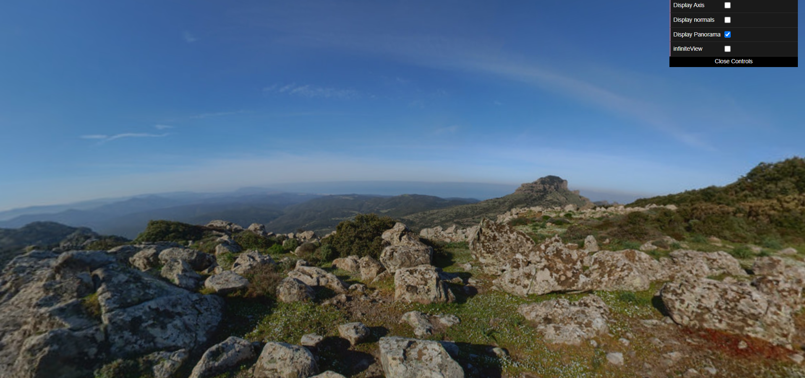
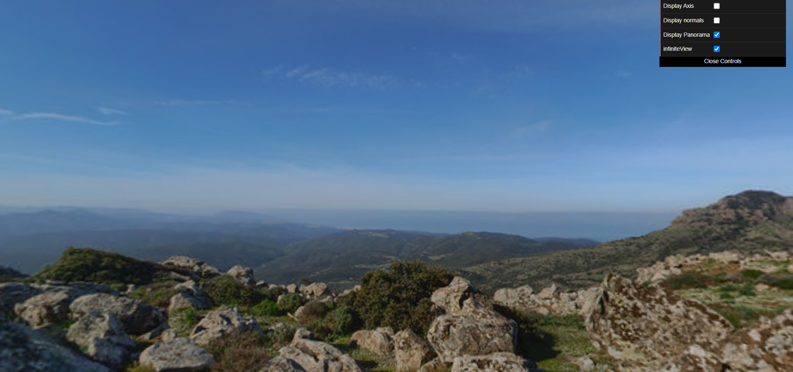

# CG 2023/2024

## Group T09G012

## Project Notes

### 1. Sky-Sphere

- No ponto 1.1, criamos uma classe `MySphere` para criação de uma esfera que representará um globo. Para sua criação, tivemos que ter por base divisões angulares. Inicialmente, tentamos seguir o exemplo do objeto `MyCylinder` criado na TP3 porém, como não nos podiamos basear na determinação de stacks pela altura e como obviamente a implementação de um cilindro difere da implementação de uma esfera, o processo obrigou-nos a raciocinar mais e demonstrou ser mais complicado. Eventualmente conseguimos chegar a uma solução e decidimos comentar o código implementado para uma fácil perceção do raciocínio aplicado.

- No ponto 1.2, criamos uma classe `MyPanorama` para aplicação de um panorama na parte interior do objeto `MySphere`. Durante a criação desta classe, ao realizarmos a aplicação da textura do panorama, reparamos que a nossa esfera não estava a ser corretamente construída devido a dois problemas. O primeiro **impedia o display da textura panorama no interior da esfera**, mesmo estando as normais corretamente invertidas. Já o segundo problema, identificado após correção do primeiro problema, **provocava uma desconfiguração do polo sul**. Dando este problemas como corrigidos, para finalizar este exercício, alteramos o **FoV** que modo a dar uma perspetiva satisfatória ao visualizador e criamos uma opção que centra a posição da câmara de modo a dar uma ilusão de que a superfície esférica se encontre sempre posicionada no infinito (`infiniteView` na GUI).

Com `infiniteView`:

