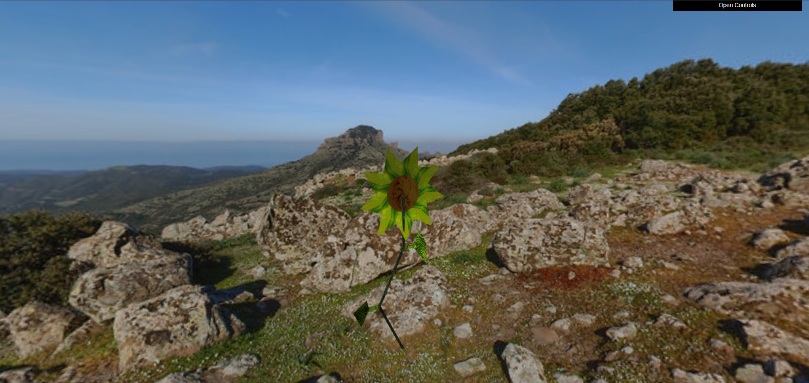
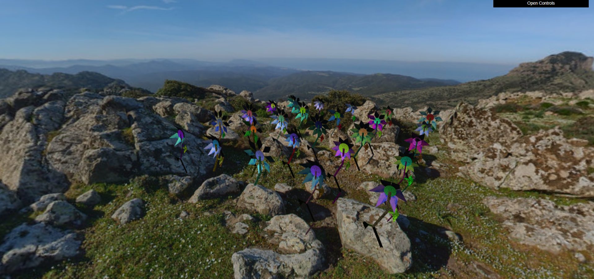
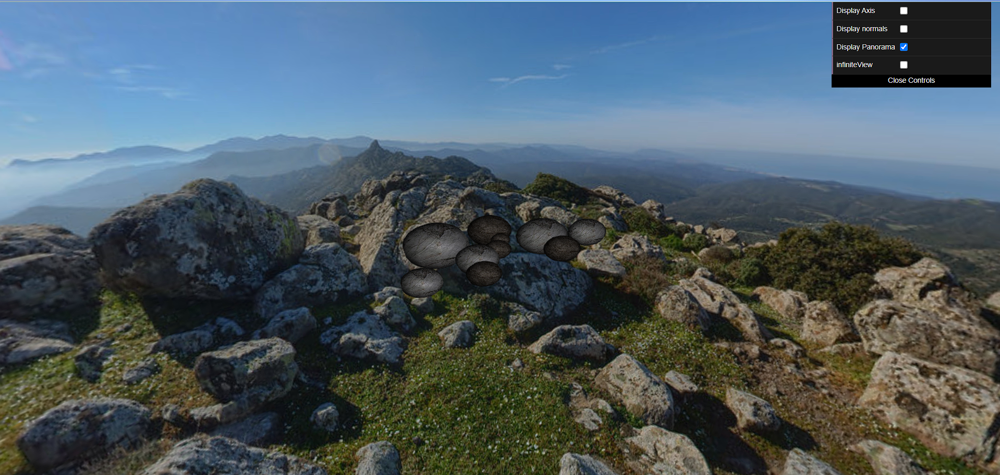
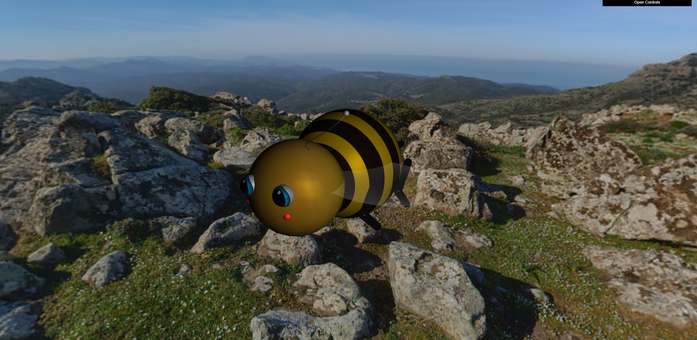
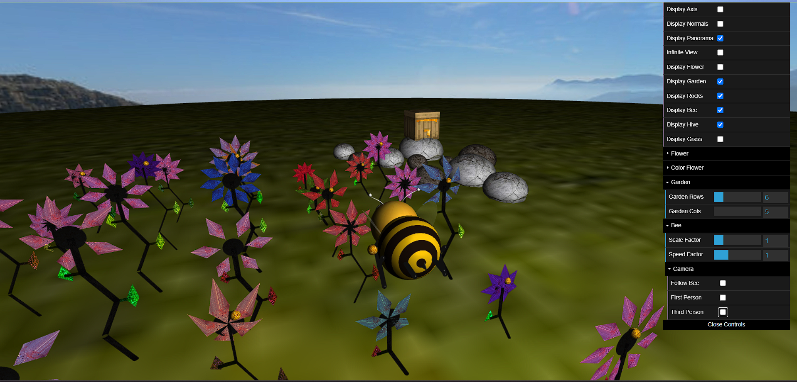
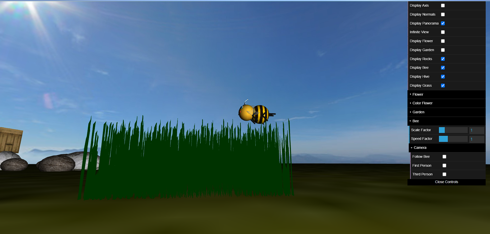

# CG 2023/2024

## Group T09G012

- João Pedro Moreira Costa (202108714) 
- Rafael Neves Teixeira (202108831)

## Observações 

Todas os pontos indicados no enunciado do projeto foram implementados, incluindo os desenvolvimentos adicionais. Porém, a funcionalidade de parábola possui alguns bugs e apenas está aplicada para quando a abelha se dirige à colmeia.

## Notas do Projeto

### 1. Sky-Sphere

- No ponto 1.1, criamos uma classe `MySphere` para criação de uma esfera que representará um globo. Para sua criação, tivemos que ter por base divisões angulares. Inicialmente, tentamos seguir o exemplo do objeto `MyCylinder` criado na TP3 porém, como não nos podiamos basear na determinação de stacks pela altura e como obviamente a implementação de um cilindro difere da implementação de uma esfera, o processo obrigou-nos a raciocinar mais e demonstrou ser mais complicado. Eventualmente conseguimos chegar a uma solução e decidimos comentar o código implementado para uma fácil perceção do raciocínio aplicado.

- No ponto 1.2, criamos uma classe `MyPanorama` para aplicação de um panorama na parte interior do objeto `MySphere`. Durante a criação desta classe, ao realizarmos a aplicação da textura do panorama, reparamos que a nossa esfera não estava a ser corretamente construída devido a dois problemas. O primeiro **impedia o display da textura panorama no interior da esfera**, mesmo estando as normais corretamente invertidas. Já o segundo problema, identificado após correção do primeiro problema, **provocava uma desconfiguração do polo sul**. 

- Dando estes problemas como corrigidos, para finalizar este exercício, alteramos o **FoV** que modo a dar uma perspetiva satisfatória ao visualizador e criamos uma opção que centra a posição da câmara de modo a dar uma ilusão de que a superfície esférica se encontre sempre posicionada no infinito (`infiniteView` na GUI).

Com `infiniteView`:

### 2. Flores

- No ponto 2.1, criamos uma classe `MyFlower` para representação de uma flor com um receptáculo, pétalas, caule e folhas. Para a sua constituição, separamos cada uma das suas componentes em diferentes classes:
    -  `MyPetal` para as representação das pétalas
    -  `MyReceptacle` para as representação do receptáculo
    -  `MyStem` para as representação do caule 

- No ponto 2.2, procuramos abrir possibilidade à personalização de cada uma das componentes da flor através da interface. Para isso, adicionamos event handlers de forma ao alterar um valor da interface, o valor atribuido ao construtor é automaticamente alterado e consequentemente a flor alterada. Nesta fase, tivemos algumas dificuldades em aplicar o ângulo para curvatura das pétalas e a alteração das características da flor mas com a ajuda da consola do browser conseguimos descobrir o que causava o problema.

- No ponto 2.3, para criação do `MyGarden`, criamos uma matriz e atribuímos a cada um do seu espaço um objeto `MyFlower` com valores aleatórios de cor, raio e tamanhos aleatórios.

- No ponto 2.4, aplicamos texturas às componentes de forma a aplicar rugosidade. Durante este processo tivemos dificuldade em aplicá-las devido a um conflito de uma componente **CFGAppearence** com os restantes materiais **CFGAppearence** de cada componente da flor. Ao descobrirmos o que causava o conflito, o resto do processo foi desenvolvido sem dificuldades

### 3. Pedras e penedos

- No ponto 3 criamos primeiro a classe `MyRock`, semelhante ao `MySphere`, onde alteramos a inclinação das normais de forma a criar ligeiras deformações e atribuir uma estrutura mais realista às pedras. De seguida, criamos a classe `MyRockSet` onde geramos 10 pedras da classe `MyRock` e as colocamos em posições diferentes e com texturas distintas.

### 4. Abelha

- No ponto 4.1, criamos a classe `MyBee` onde tratamos da modelação da abelha. Durante este processo, alguns dos objetos anteriormente criados foram aproveitados como o objeto `MyStem` para a criação das patas da abelha. Tivemos algumas dificuldades e problemas durante a criação do sorriso da abelha (`MySmile`) pois, apesar de parecer simples, implementamos esse objeto de acordo com as curvas de Bézier estudadas nas aulas teórica que demonstrou ser um pouco complicado.

- No ponto 4.2, tratamos da parte do movimento de oscilação da abelha e do batimento de asas destas. Para criar o movimento oscilatório, criamos a função `updateBee()` e recorremos a uma variável de tempo para conseguir obter um movimento contínuo da abelha porém, foi **necessário aplicar uma variável de frequência** pois a abelha **executava demasiados movimentos oscilatórios** numa questão de poucos segundos. Assim, a abelha passou a ter um movimento de oscilação satisfatório ao olho humano. De seguida, para estabelecer o ângulo e a rapidez do batimento das asas da abelha, recorremos à função **seno**, cujo valor atribuído correspondia ao tempo decorrido. Deste forma, as asas adquiriram uma animação **porém batiam demasiado rápido** pelo que tivemos que**reduzir a variável tempo** introduzida dentro da função **seno** ao multiplicá-la por um fator de `0.05`.

- No ponto 4.3, começamos por introduzir o código fornecido pelo guião no nosso trabalho que tinha como função registar as teclas que estavam a ser pressionadas no teclado. Apesar de ser um passo simples, **deparamo-nos com problemas**, pois as funções que verificavam se **as teclas estavam a ser pressionadas não estavam a ser processadas** pelo programa. Tentamos encontrar o que causava o problema mas passado imenso tempo à procura sem descobrir, **tivemos que recorrer ao professor** das aulas práticas para resolver esta situação. Com isto, graças ao professor, conseguimos avançar com o trabalho pois descobriu que **uma função que já não utilizavamos** estava a **causar um ciclo infinito**, o que impedia o programa de avançar para a parte do registo das teclas. Removendo essa tal função, as teclas passaram a conseguir ser registadas. 

- Dando este problema como resolvido, aplicamos as operações de deslocação, rotação e reposicionamento da abelha. Durante estas implementações, tivemos inicialmente dificuldades em descobrir como fazer com que a abelha se deslocasse com movimentação constante após pressionar e largar a tecla `W` e em fazer com que a abelha se movimentasse de acordo à direção para onde esta apontava. Como soluções, na função `updateBee()`, somamos constantemente à posição da abelha a velocidade atualmente registada e de acordo com a função **seno** e **cosseno** e o ângulo atual de rotação da abelha, conseguimos determinar quanto incrementar às posições **x** e **z**, respetivamente, de modo a que a abelha apenas se desloque para onde se encontra direcionada. 

- Para terminar este módulo, criamos 3 tipos de visão da câmara: um que **segue a abelha**, um de **primeira pessoa** e outro de **terceira pessoa**.

### 5. Pólen e Colmeia

- No ponto 5.1, criamos um objeto `MyPollen` aproveitando o objeto `MySphere`, criado anteriormente, mas **aplicando um escalamento no eixo dos yy** de forma a alongar o elemento e **obter uma forma oval**. Para aplicar o pólen à flor, adicionou-se uma variável **hasPolen** ao construtor de `MyFlower` que permite **identificar quais flores possuem pólen** e, consequentemente, saber em quais flores se dá display do pólen. Com isto, foi necessário modificar o processo de criação das flores na classe `MyGarden`, sendo atribuída uma percentagem de 50% de cada flor possuir pólen. De seguida, foi necessário criar uma classe `MyHive` para representação de uma colmeia, tendo nós como inspiração a colmeia do jogo Minecraft.

- No ponto 5.2, foram aplicadas **operações de controlo da abelha para obtenção e armazenamento do pólen**. Este processo **demonstrou ser complicado** pois foi necessário determinar uma forma inteligente e eficiente de **determinar se a abelha ao baixar, se situava sobre uma flor**. Como solução, **para cada flor** no `MyGarden`, **criou-se uma área quadrada** à qual se **verificava se a posição atual da abelha coincidia** e **determinou-se a altura a que a abelha teria que descer** com base na altura do caule da flor. Coincidindo, a abelha realiza um movimento descendente no eixo dos yy, não coincidindo, se a abelha se situar fora do jardim, não realiza qualquer operação. Vários erros foram verificados durante esta fase, como a abelha bloquear se tentasse apanhar pólen fora do jardim, a abelha conseguir apanhar sempre pólen da mesma flor, bloquear ao tentar apanhar uma flor de maior altura, etc, mas felizmente todos esses problemas foram corrigos.

- Aproveitando a variável **hasPolen** mencionada anteriormente, o **processo de deteção de flores com pólen tornou-se fácil** e, consequentemente, **facilitou o processo de a abelha apenas conesguir apanhar pólen de flores que o contêm**. Por último, o **processo de dirigir a abelha até à colmeia** com pólen, **demonstrou ser também complicado**. Acabamos por encontrar uma **solução**, dirigindo a abelha **primeiro ao eixo dos xx e depois seguir pelo eixo dos zz** até se situar na posição da colmeia. Uma abordagem que gostariamos de ter adotado antes seria a determinação da distância da posição atual da abelha e a da colmeia e com base nisso fazer uma deslocação direta até à colmeia em vez de apenas se guiar por um dos eixos. Foi devido ao pormenor de possuirmos outros projetos para terminar que não tivemos tempo para aplicar essa implementação.

### 6. Shaders e Animação

- No ponto 6.1, criamos duas classes, uma para a modelação de um elemento de relva, `MyGrass`, e outra para representação de um "canteiro" de relva `MyGrassPatch`. Para **contrução de um elemento relva** (`MyGrass`), foram **utilizadas fitas triangulares** e um **fator curva** para dar um ar mais realista. Já para criação do "canteiro" (`MyGrassPatch`), utilizaram-se dois ciclos *for* para criação de uma matriz 50x50 e de modo a que cada flor ocupe a posição adequada ao longo dos eixos xx e zz. Durante este processo foi **também introduzida alguma aleatoridade** nas **coordenadas x e z** e na **altura** de cada elemento da relva.

- No ponto 6.2, passamos à parte do desenvolvimento dos shaders da relva. Esta fase do trabalho foi-nos **relativamente complexa** pois **demoramos algum tempo** até obtermos o **efeito pretendido** que tinha por base o **ângulo de incidência do vento e da sua força**. Para além disso, estavamos inicialmente a atribuir um shader a cada elemento de relva, o que obrigava a uma demanda computacional demasiado elevada pelo computador e, por isso, como solução, aplicamos antes o shader ao "canteiro" de relva, o que provocou uma maior fluidez do nosso trabalho já que o shader estava a ser carregado um menor número de vezes.

