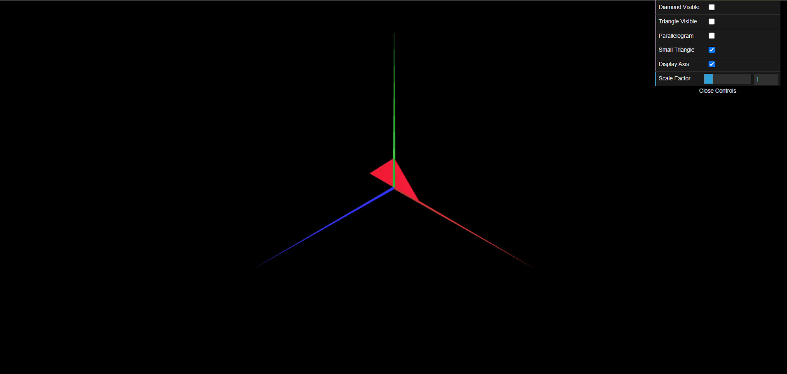
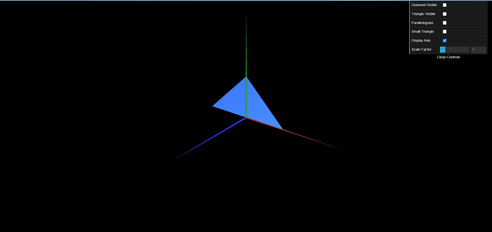

# CG 2023/2024

## Group T09G012

## TP 1 Notes

### Exercício 1:

- No ponto 1, foi desenvolvido o ficheiro **MyTriangle.js** com apenas 1 triângulo de base, seguindo como exemplo o ficheiro **MyDiamond.js**.

- No ponto 2 foram criados controladores de interface para controlar a visibilidade dos objetos na cena, no ficheiro **MyInterface.js** (dentro da função `init()`), e variáveis booleanas e objetos dos objetos geométricos que queremos desenhar (dentro da função `init()` do **MyScene.js**) para os associar aos controladores respetivos e determinar quando se irá dar display ou não display dos objetos (dentro da função `display()` do ficheiro **MyScene.js**).

- No ponto 3 criamos um paralelogramo double sided através da repetição dos índices e da sua ordem

- No ponto 4 repetimos o que se fez no ponto 2 mas para o objeto do paralelogramo

### Exercício 2

- Através dos passos anteriores e do código do ficheiro **MyTriangle.js**, criamos as figuras `MyTriangleSmall` e `MyTriangleBig` e as suas respetivas checkoxes de visibilidade.

