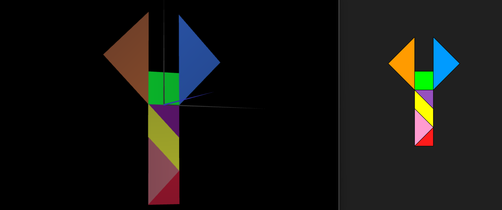
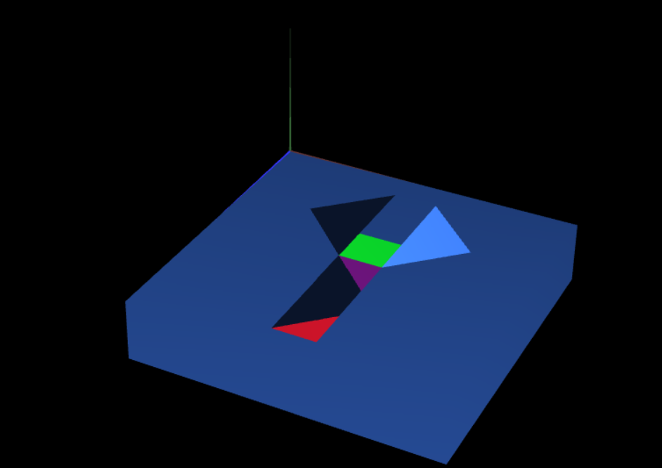
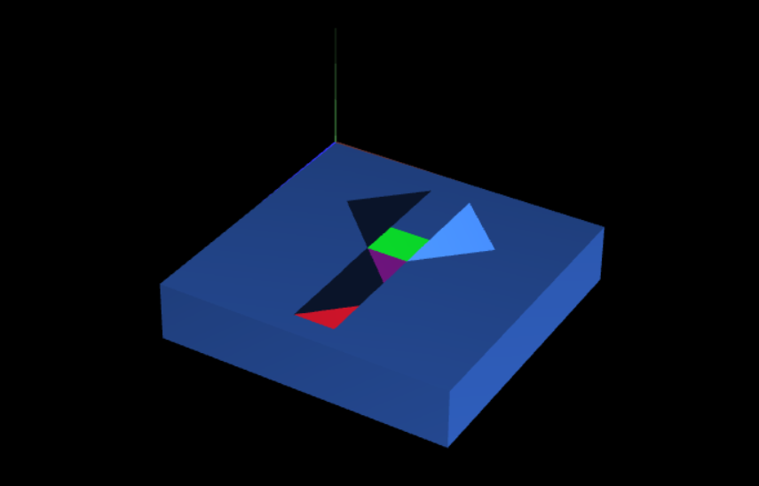

# CG 2023/2024

## Group T09G012

## TP 2 Notes

### Exercício 2

- No ponto 1 colocou-se o objeto `MyDiamond` no plano XY através de operações com matrizes com a função **multMatrix()**. Para criação do tangram, rodamos o diamante de forma a assumir a forma de um quadrado com a aplicação de uma matriz de rotação e centrámo-lo na origem do eixo dos y para que ficasse simétrico.

- No ponto 2 foram adicionadas as restantes peças do tangram nas posições respetivas relativamente à imagem que nos foi atribuída, utilizando operações de translação, rotação e escalamento. 

- No ponto 3 foi criada uma classe `MyTangram` para que esta seja a responsável em dar display de todas as peças que constituem o tangram. No ficheiro `MyScene` é chamada a função da classe `MyTangram` que dá display do tangram.

### Exercício 3

- No ponto 1 criou-se um ficheiro **MyUnitCube.js** e nele foram definidos 8 vértices e suas ligações para criação de um cubo com 1 unidade de medida de lado dentro da função **initbuffers()**. 

- No ponto 2 importou-se o ficheiro **MyUnitCube.js** no **MyScene.js**.

- No ponto 3, dentro do **MyScene**, criou-se um objeto do tipo **MyUnitCube** na função **init()** e invocou-se a função **display()** desse objeto na função **display()** do **MyScene**. Desta forma, foi apresentado na tela um cubo unitário centrado na origem.

- No ponto 4 foram aplicadas transformações de forma a que o cubo ficasse inserido atrás do tangram, servindo como base. Para tal foram aplicadas transformações de translação e escalamento.

- No ponto 5 alteramos o cubo para uma estrutura com menos profundidade **(transformação de escalamento)**, do género de um tabuleiro para facilitar a observação do conjunto, paralelizámo-lo ao plano XZ **(transformação de rotação)** e inserimos o seu canto frontal superior esquerdo na coordenada (0,0,0) **(transformação de translação)**. De seguida, foram aplicadas transformações ao tangram de forma a que este ficasse centrado e colado à base.

### Exercício 4

- No ponto 1 criou-se uma classe `MyQuad`, que constitui um quadrado com lados de medida 1, para futura construção de um cubo unitário.

- No ponto 2 criou-se uma classe `MyUnitCubeQuad` que constitui um cubo criado através da classe `MyQuad`.

- No ponto 3, substituindo o cubo criado no exercício anterior pelo cubo criado no ponto anterior da classe `MyUnitCubeQuad`, não se verificam nenhumas diferenças uma vez que estes ocupam exatamente a mesma posição no espaço.

