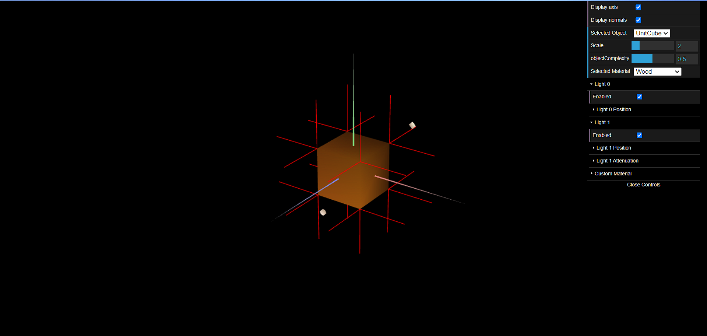
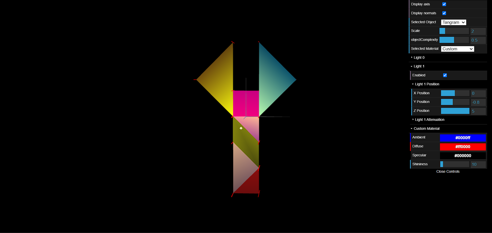
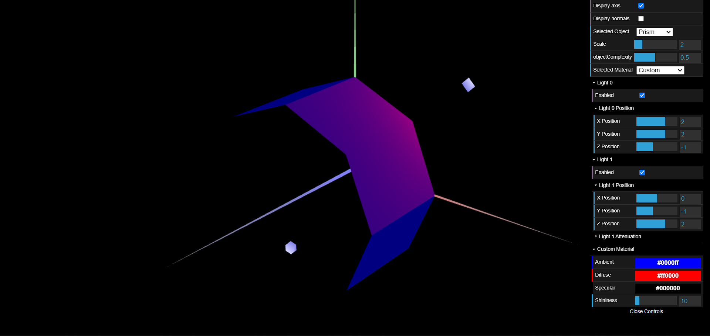

# CG 2023/2024

## Group T09G012

## TP 3 Notes

### Exercício 1

- No ponto 1 foram criadas as instâncias de `MyTangram` e `MyUnitCube`, da aula passada, na cena  e adicionadas à lista de objetos apresentada na GUI.

- No ponto 2 foram realizadas algumas experiências com a iluminação. Foi observado que existiam algumas irregularidades na iluminação devido à falta de normais declaradas nos objetos que constituem o tangram e o cubo.

- No ponto 3 todas as normais dos elementos que constituem as instâncias `MyTangram` e `MyUnitCube` foram estabelecidas. Para tal, na maior parte dos casos foi necessário duplicar os vértices dos elementos para que as normais apontassem tanto num sentido como no outro, relativamente a uma determinada direção. Para verificar se foram bem aplicadas, ativamos a checkbox que demonstrava na interface todas as normais estabelecidas do objeto apresentado.

- No ponto 4 foi criado um material semelhante a um aspeto de madeira, com baixa componente especular, e adicionado à lista de materiais já disponibilizados:

- No ponto 5 criamos um material customizado para cada uma das peças da classe `MyTangram` com elevada componente especular.

- No ponto 6 aplicamos o material **Custom** na peça `MyDiamond`, sendo este material controlável na interface:

### Exercício 2

- No ponto 7 criamos a instancia do `MyPrism` com um número variável de slices e stacks, depois criamos as normais do prisma.

- No ponto 8 importamos o `MyPrism` para a `MyScene`, onde criamos um prima com 8 lados e display do prisma.

- No ponto 9 implementamos um suporte para o desenho de vários andares e desenhamos com 20 andares.

