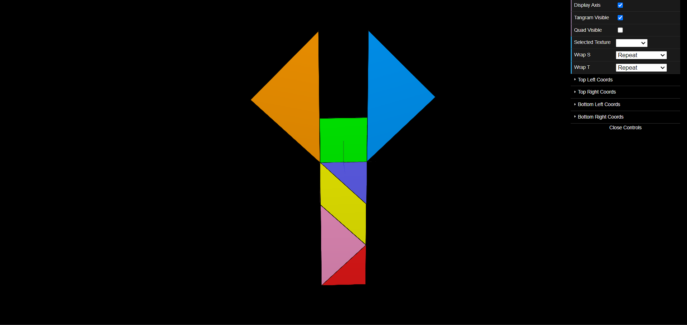

# CG 2023/2024

## Group T09G012

## TP 4 Notes

### Exercício 1

- No ponto 1, carregamos e definimos como textura a imagem **tangram.png**

- No ponto 2, definimos as coordenadas de textura (**texCoords**) do `MyDiamond` de modo a que as arestas do losango coincidissem com as arestas do objeto. Inicialmente, este processo foi um pouco confuso já que as coordenadas (s, t) não são idênticas às coordenadas tradicionais (x, y) e já que tivemos que associar cada um dos vértices do objeto ao ponto respetivo da imagem de textura. Porém, com alguma prática, e com ajuda da imagem **tangram-lines.png**, acabamos por realizar este processo sem grandes dificuldades.

- No ponto 3, definimos as coordenadas de textura das restantes peças do tangram. Para o caso de elementos repetidos, como o caso do `MyTriangleBig`, estavamos com dificuldades em descobrir como criar dois objetos do mesmo tipo com **texCoords** diferentes. Como solução, acabamos por acrescentar um parâmetro no construtor do objeto `MyTriangleBig` que irá receber as **texCoords**, de forma a que possamos realizar um mapeamento distinto das coordenadas de textura para cada objeto criado.

