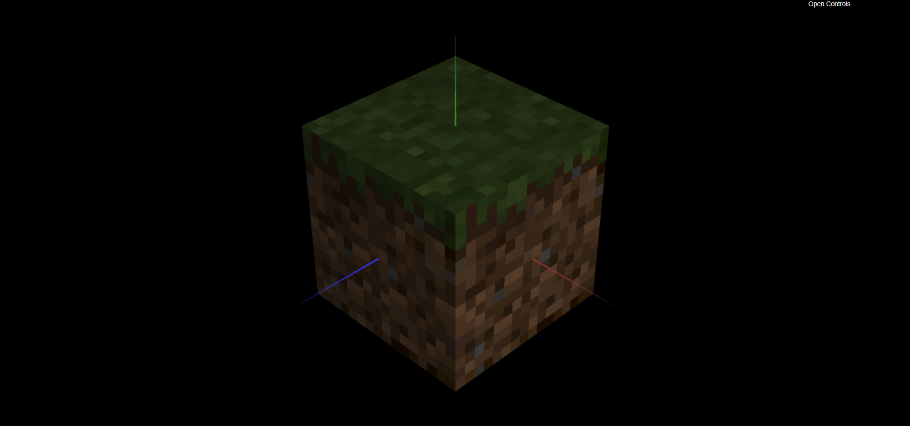

# CG 2023/2024

## Group T09G012

## TP 4 Notes

### Exercício 1

- No ponto 1, carregamos e definimos como textura a imagem **tangram.png**

- No ponto 2, definimos as coordenadas de textura (**texCoords**) do `MyDiamond` de modo a que as arestas do losango coincidissem com as arestas do objeto. Inicialmente, este processo foi um pouco confuso já que as coordenadas (s, t) não são idênticas às coordenadas tradicionais (x, y) e já que tivemos que associar cada um dos vértices do objeto ao ponto respetivo da imagem de textura. Porém, com alguma prática, e com ajuda da imagem **tangram-lines.png**, acabamos por realizar este processo sem grandes dificuldades.

- No ponto 3, definimos as coordenadas de textura das restantes peças do tangram. Para o caso de elementos repetidos, como o caso do `MyTriangleBig`, estavamos com dificuldades em descobrir como criar dois objetos do mesmo tipo com **texCoords** diferentes. Como solução, acabamos por acrescentar um parâmetro no construtor do objeto `MyTriangleBig` que irá receber as **texCoords**, de forma a que possamos realizar um mapeamento distinto das coordenadas de textura para cada objeto criado.


### Exercício 2

- No ponto 4, copiamos a class MyUnitCubeQuad desenvolvida no **tp2**. Como o objeto `MyQuad`, já disponibilizado nesta aula, possui configurações diferentes ao nosso `MyQuad` desenvolvido na **tp2**, o nosso `MyUnitCubeQuad` ficou mal construído, sendo necessário alterar as configurações do mesmo.

- No ponto 5, fizemos com que o construtor do nosso `MyUnitCubeQuad` recebesse seis texturas (frente, topo, esquerda, direita, atrás e base) e alteramos a nossa função `display()` de forma a que essas texturas podessem ser carregadas corretamente.

- No ponto 6, carregamos as imagens de textura do bloco do Minecraft. Ao topo associamos a imagem `mineTop.png`, à base `mineBottom.png` e aos 4 lados restantes a imagem `mineSide.png`. Desta forma, obtivemos a construção do cubo de terra do Minecraft, porém as texturas de cada um dos lados estava pouco definida e com baixa qualidade. Para resolver este problema, passamos ao ponto 7:

- No ponto 7, de forma a corrigir a má definição das texturas, utilizamos este comando, que veio comentado na pasta de código inicialmente fornecida dentro do ficheiro **MyScene.js**, depois da ativação de cada textura mas antes de efetuar o desenho de cada face do cubo:

```js
this.gl.texParameteri(this.gl.TEXTURE_2D, this.gl.TEXTURE_MAG_FILTER, this.gl.NEAREST);
```

Desta forma, esta foi a versão final da imagem obtida:



