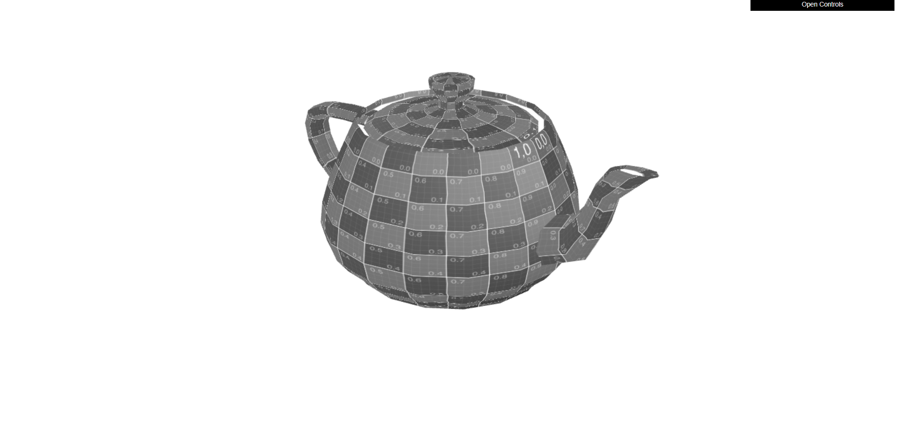

# CG 2023/2024

## Group T09G012

## TP 5 Notes

### Exercício 1

- No ponto 1, criamos um novo shader chamado `teapot`. Dentro do ficheiro **teapot.vert**, recolhemos a posição dos vértices de forma a que no ficheiro **teapot.frag** conseguissemos definir quais pontos ficariam com a cor amarela (y > 0.5) ou azul (y <= 0.5).

- No ponto 2, para criação de uma animação de translação no eixo XX seguindo uma onda sinusoidal, associamos uma variável `timeFactor` ao shader `teapot`, idêntica à utilizada no shader 6, já que como esta variável vai-se sempre alterando ao longo do tempo, pode ser utilizada para criar um efeito de onda através da soma do cálculo de `sin(timeFactor)` à posição x do aVertexPosition.

- No ponto 3, para criação do fragment shader `graysepia`, partimos do exemplo do fragment shader `sepia` e alteramos os valores RGB, multiplicando cada uma das suas componentes pelos valores indicados no enunciado : `L = 0.299R + 0.587G + 0.114B`.

### Exercício 2

- No ponto 1, criamos dois novos shaders chamados `water.vert` e `water.frag` com base nos fichieros `texture2.vert` e `texture2.frag`.

- No ponto 2, colocamos as imagens `waterMap.jpg` e `waterTex.jpg` no `testShaders` para conseguirmos testar no WebGl e conseguimos verificar que estavam presentes manchas de tom vermelho escuro.

- No ponto 3, alteramos o `water.vert` de forma a utiliza o `waterMap.jpg` como mapa de alturas da textura de água, conseguimos isso alterando a posição a partir da variável `offset` que altera o `aVertexPosition` em função do `waterMap.jpg`.

- No ponto 4, adicionamos uma variável de tempo, `timeFactor`, ao `offset` para alterar em função do tempo e do `waterMap.jpg`.

