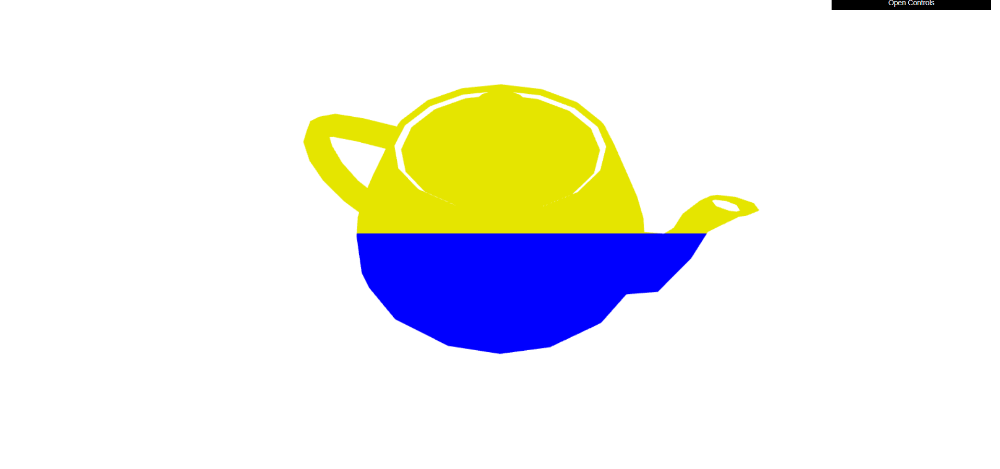

# CG 2023/2024

## Group T09G012

## TP 5 Notes

### Exercício 1

- No ponto 1, criamos um novo shader chamado `teapot`. Dentro do ficheiro **teapot.vert**, recolhemos a posição dos vértices de forma a que no ficheiro **teapot.frag** conseguissemos definir quais pontos ficariam com a cor amarela (y > 0.5) ou azul (y <= 0.5).

- No ponto 2, 

### Exercício 2
